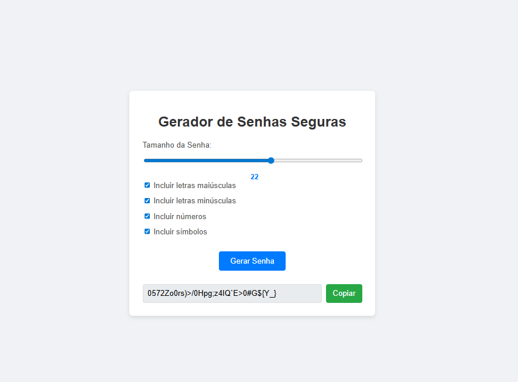

# 📄 Documentação do Projeto: Gerador de Senhas Seguras



## 📋 Índice

1. [Visão Geral](#-visão-geral)
2. [Estrutura do Projeto](#-estrutura-do-projeto)
3. [Funcionalidades](#-funcionalidades)
4. [Tecnologias Utilizadas](#-tecnologias-utilizadas)
5. [Instalação e Uso](#-instalação-e-uso)
6. [API da Aplicação](#-api-da-aplicação)
7. [Testes](#-testes)
8. [Estrutura de Arquivos](#-estrutura-de-arquivos)
9. [Personalização](#-personalização)
10. [Considerações de Segurança](#-considerações-de-segurança)

---

## 🎯 Visão Geral

O **Gerador de Senhas Seguras** é uma aplicação web que permite aos usuários criar senhas robustas e personalizáveis com diversos critérios de segurança. A aplicação garante que cada senha gerada inclua pelo menos um caractere de cada tipo selecionado, seguindo as melhores práticas de segurança.

---

## 📁 Estrutura do Projeto

```
gerador-senhas-seguras/
│
├── 📄 index.html # Página principal HTML
├── 📄 package.json # Configurações do projeto e dependências
├── 📄 .gitignore # Arquivos ignorados pelo Git
│
├── 📂 css/
│ └── 📄 style.css # Estilos da aplicação
│
├── 📂 js/
│ └── 📄 app.js # Lógica principal da aplicação
│
├── 📂 src/
│ └── 📄 passwordGenerator.js # Módulo de geração de senhas (para testes)
│
├── 📂 tests/
│ ├── 📄 passwordGenerator.test.js # Testes unitários
│ └── 📄 test-results.json # Resultados dos testes
│
└── 📂 public/ # Recursos públicos (imagens, ícones, etc.)
```

---

## ⚙️ Funcionalidades

- ✅ **Personalização de Comprimento**: Senhas de 8 a 32 caracteres
- ✅ **Tipos de Caracteres Incluídos**:
  - Letras maiúsculas (A-Z)
  - Letras minúsculas (a-z)
  - Números (0-9)
  - Símbolos especiais (!@#$%^&\*()\_+~`|}{[]:;?><,./-=)
- ✅ **Geração Garantida**: Inclui pelo menos um caractere de cada tipo selecionado
- ✅ **Embaralhamento Aleatório**: Garante total aleatoriedade na senha final
- ✅ **Copiar para Área de Transferência**: Botão dedicado para copiar a senha gerada
- ✅ **Interface Responsiva**: Design adaptável para diferentes dispositivos

---

## 🛠️ Tecnologias Utilizadas

- **HTML5**: Estrutura semântica da aplicação
- **CSS3**: Estilização e design responsivo
- **JavaScript**: Lógica de geração de senhas e interatividade
- **Jest**: Framework de testes unitários
- **Node.js**: Ambiente de execução para testes

---

## 📥 Instalação e Uso

### Pré-requisitos

- Navegador web moderno (Chrome, Firefox, Safari, Edge)
- Node.js (apenas para execução dos testes)

### Instalação

1. Clone ou baixe o projeto
2. Extraia os arquivos em uma pasta local

### Execução

1. Abra o arquivo `index.html` em seu navegador
2. Personalize as opções de geração de senha
3. Clique em "Gerar Senha"
4. Use "Copiar" para salvar a senha gerada

### Execução do projeto
```
public/index.html
```
### Execução dos Testes

```
npm test
```

## 🔌 API da Aplicação

**Função: generatePassword(length, options)**

_Parâmetros:_

- `length` (Number): Comprimento da senha (8-32)

- `options` (Object): Configurações dos tipos de caracteres:

  - `includeUppercase` (Boolean): Incluir letras maiúsculas

  - `includeLowercase` (Boolean): Incluir letras minúsculas

  - `includeNumbers` (Boolean): Incluir números

  - `includeSymbols` (Boolean): Incluir símbolos

Retorno:

- `String`: Senha gerada ou string vazia se nenhuma opção for selecionada

Exemplo de uso:

```
const senha = generatePassword(16, {
  includeUppercase: true,
  includeLowercase: true,
  includeNumbers: true,
  includeSymbols: false
});
```

## 🧪 Testes

**Suíte de Testes Implementados**

1. **Geração de Tamanho Correto**

   - Verifica se a senha tem o comprimento solicitado

2. **Inclusão de Tipos Específicos**

   - Testa a inclusão de maiúsculas, minúsculas, números e símbolos

3. **Exclusão de Tipos Não Solicitados**

   - Garante que caracteres não selecionados não estejam presentes

4. **Tratamento de Casos Especiais**

   - Retorno de string vazia quando nenhuma opção é selecionada

5. **Aleatoriedade**

   - Verifica que senhas consecutivas são diferentes

**Execução e Resultados:**

```
npm test
# Resultado: 8 testes aprovados
```

## 📋 Estrutura de Arquivos

**Arquivos Principais**

- index.html: Estrutura básica da aplicação web

- css/style.css: Estilos e design responsivo

- js/app.js: Lógica principal de geração e interface

**Arquivos de Teste**

- src/passwordGenerator.js: Módulo de geração de senhas

- tests/passwordGenerator.test.js: Testes unitários

- tests/test-results.json: Resultados da execução dos testes

**Configurações**

- package.json: Dependências e scripts do projeto

- .gitignore: Configuração de arquivos ignorados pelo Git

---

## 🎨 Personalização

**Modificando os Caracteres**

Edite as constantes no arquivo `js/app.js:`

```
const uppercaseChars = 'ABCDEFGHIJKLMNOPQRSTUVWXYZ';
const lowercaseChars = 'abcdefghijklmnopqrstuvwxyz';
const numberChars = '0123456789';
const symbolChars = '!@#$%^&*()_+~`|}{[]:;?><,./-=';
```

**Alterando o Intervalo de Comprimento**

Modifique os atributos `min` e `max` no HTML:

```
<input type="range" id="password-length" min="8" max="32" value="12">
```

**Personalizando o Visual**

Edite o arquivo `css/style.css` para modificar cores, fontes e layout.

## 🔒 Considerações de Segurança

- A aplicação utiliza `Math.random()` para geração de números aleatórios

- Para casos de uso que exigem segurança criptográfica máxima, considere implementar `window.crypto.getRandomValues()`

- As senhas são geradas apenas no lado do cliente e não são transmitidas pela rede

## 📞 Suporte

Para issues e melhorias, verifique a documentação ou entre em contato com a equipe de desenvolvimento.

**Desenvolvido com foco em segurança e usabilidade 🔐**
